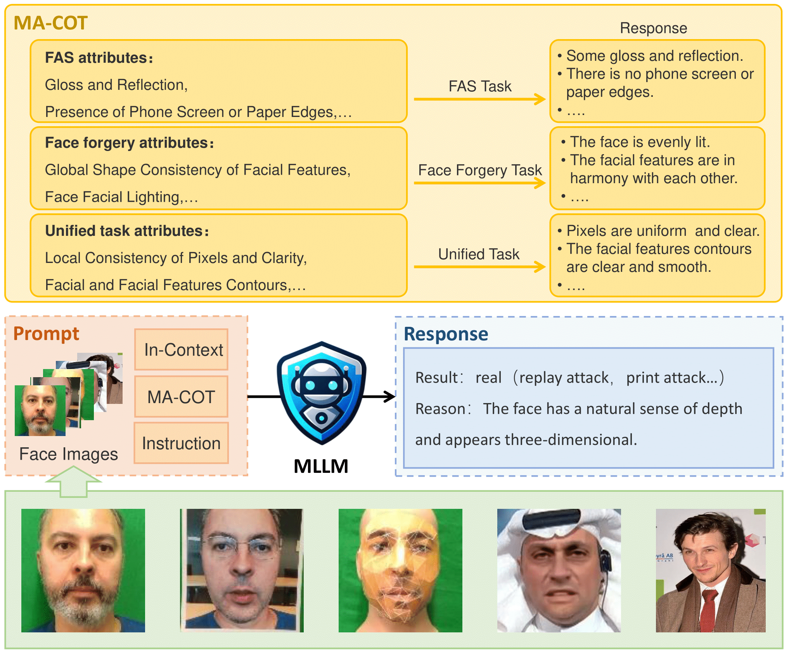

# SHIELD: An Evaluation Benchmark for Face Spoofing and Forgery Detection with Multimodal Large Language Models

  	
  
  
     

## Overview
In this paper, we conduct a detailed comparison of two models: Google's **Gemini** and OpenAI's **GPT-4V(ision)**. We utilize Zero-Shot/One-Shot as well as COT methods to comprehensively analyze the performance of these two models in FAS and Face Forgery Detection tasks.

## Release
- [2024/2/6]🔥🔥🔥We will release the evaluation result (about 100 pages) and the code very soon.
